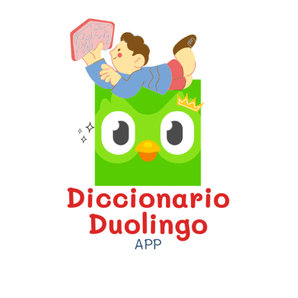

# DiccionarioDuolingo

_**DiccionarioDuolingo**, es un proyecto diseñado para facilitar la gestión de un diccionario de palabras en un entorno de aplicación de consola. La necesidad de este proyecto surge de la importancia de tener una herramienta eficiente para almacenar, buscar, agregar y eliminar palabras en un diccionario, especialmente en contextos educativos._

&nbsp;&nbsp;&nbsp;&nbsp;&nbsp;&nbsp;&nbsp;&nbsp;&nbsp;&nbsp;&nbsp;&nbsp;&nbsp;&nbsp;&nbsp;&nbsp;&nbsp;&nbsp;&nbsp;&nbsp;&nbsp;&nbsp;&nbsp;&nbsp;&nbsp;&nbsp;&nbsp;&nbsp;&nbsp;&nbsp;&nbsp;&nbsp;&nbsp;&nbsp;&nbsp;&nbsp;&nbsp;&nbsp;&nbsp;&nbsp;&nbsp;&nbsp;&nbsp;&nbsp;&nbsp;&nbsp;&nbsp;&nbsp;&nbsp;&nbsp;&nbsp;

**Autor del proyecto:** Doménica Alejandra Nieto León 

---
- Encuentra el _**Manual de Programa**_ [<<**aquí**>>](docs/MANUAL_PROGRAMA.md) 