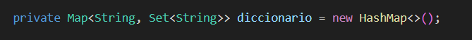
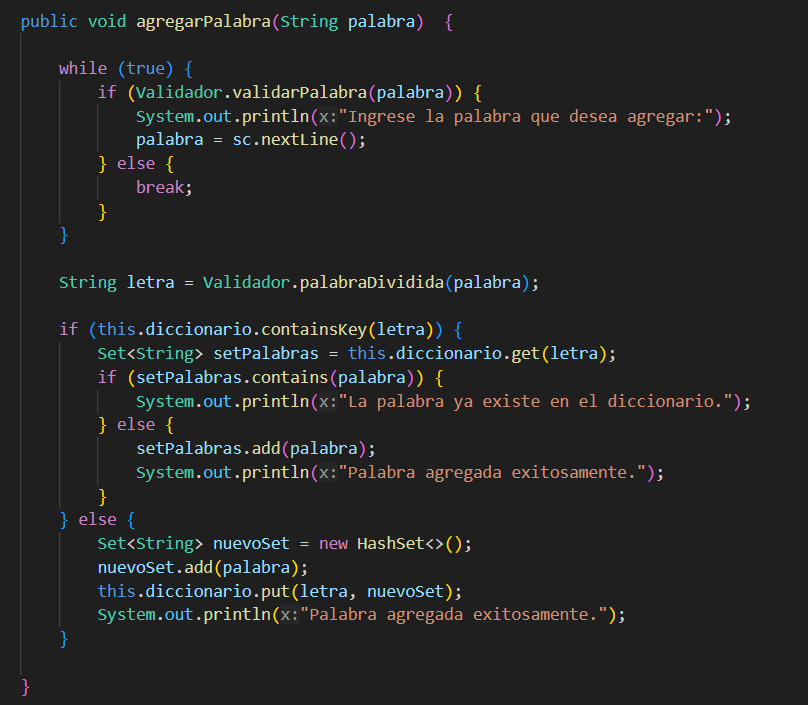
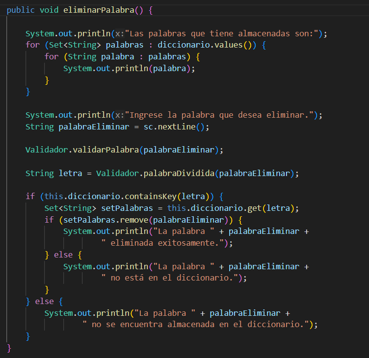
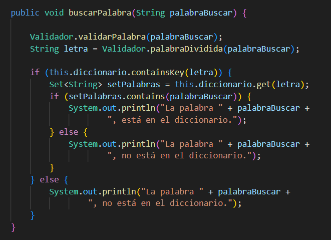
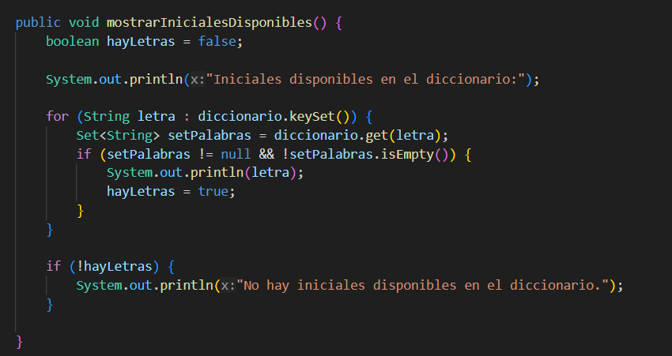
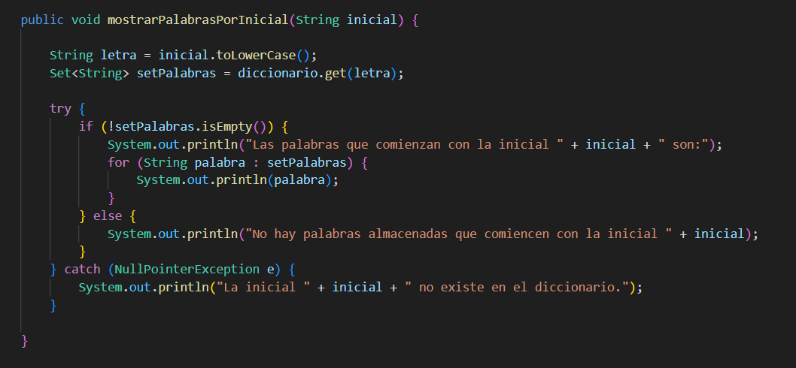

## CLASE DICCIONARIO
### Atributos
&nbsp;&nbsp;&nbsp;&nbsp;&nbsp;&nbsp;&nbsp;&nbsp;&nbsp;&nbsp;&nbsp;&nbsp;&nbsp;&nbsp;&nbsp;&nbsp;&nbsp;&nbsp;&nbsp;&nbsp;&nbsp;&nbsp;&nbsp;&nbsp;&nbsp;&nbsp;

### Métodos
- **agregarPalabra(String palabra)**

Este método permite agregar una palabra al diccionario. 

#### Parámetros:
String: Cualquier cadena de caracteres que represente una palabra.

#### Salidas:
Mensajes que indican si la palabra fue agregada exitosamente al diccionario, si ya existe en el diccionario o si la palabra ingresada es inválida.

#### Funcionalidad:

- Primero, se valida la palabra utilizando el método validarPalabra de la clase Validador.

- Si la palabra es válida, se obtiene la letra inicial de la palabra utilizando el método palabraDividida de la clase Validador

- Se verifica si el diccionario ya contiene la letra inicial. 

_Si la letra ya existe, se agrega la palabra al conjunto de palabras asociadas a esa letra._

_Si la letra no existe, se crea un nuevo conjunto de palabras asociadas a esa letra y se agrega la palabra al diccionario._

_Si la palabra ya existe en el diccionario, se muestra un mensaje indicando que la palabra ya existe._

&nbsp;&nbsp;&nbsp;&nbsp;&nbsp;&nbsp;&nbsp;&nbsp;&nbsp;&nbsp;&nbsp;&nbsp;&nbsp;&nbsp;&nbsp;&nbsp;&nbsp;&nbsp;&nbsp;&nbsp;&nbsp;&nbsp;&nbsp;&nbsp;&nbsp;&nbsp;&nbsp;&nbsp;&nbsp;&nbsp;&nbsp;&nbsp;&nbsp;&nbsp;&nbsp;&nbsp;&nbsp;&nbsp;&nbsp;&nbsp;&nbsp;&nbsp;&nbsp;&nbsp;&nbsp;&nbsp;&nbsp;&nbsp;&nbsp;&nbsp;&nbsp;&nbsp;&nbsp;&nbsp;&nbsp;&nbsp;&nbsp;&nbsp;&nbsp;&nbsp;&nbsp;&nbsp;&nbsp;

---

- **eliminarPalabra()**

Permite eliminar una palabra del diccionario.

#### Entradas:
String: Cualquier cadena de caracteres que represente una palabra existente en el diccionario.

#### Salidas:
Mensajes que indican si la palabra fue eliminada exitosamente del diccionario o si la palabra no está en el diccionario.

#### Funcionalidad:

- Primero, se muestra una lista de todas las palabras almacenadas en el diccionario.

- Se solicita al usuario que ingrese la palabra que desea eliminar. 

- Se valida la palabra utilizando el método validarPalabra de la clase Validador y se obtiene la letra inicial de la palabra utilizando el método palabraDividida.

_Si la palabra existe en el diccionario, se elimina del conjunto de palabras asociadas a esa letra._

_Si la palabra no existe en el diccionario, se muestra un mensaje indicando que la palabra no está en el diccionario._

&nbsp;&nbsp;&nbsp;&nbsp;&nbsp;&nbsp;&nbsp;&nbsp;&nbsp;&nbsp;&nbsp;&nbsp;&nbsp;&nbsp;&nbsp;&nbsp;&nbsp;&nbsp;&nbsp;&nbsp;&nbsp;&nbsp;&nbsp;&nbsp;&nbsp;&nbsp;&nbsp;&nbsp;&nbsp;&nbsp;&nbsp;&nbsp;&nbsp;&nbsp;&nbsp;&nbsp;&nbsp;&nbsp;&nbsp;&nbsp;&nbsp;&nbsp;&nbsp;&nbsp;&nbsp;&nbsp;&nbsp;&nbsp;&nbsp;&nbsp;&nbsp;&nbsp;&nbsp;&nbsp;&nbsp;&nbsp;&nbsp;&nbsp;&nbsp;&nbsp;&nbsp;&nbsp;&nbsp;

---

- **buscarPalabra(String palabraBuscar)**

Permite buscar una palabra en el diccionario.

#### Entradas:
String: Cualquier cadena de caracteres que represente una palabra.

#### Salidas:
Mensajes que indican si la palabra está en el diccionario o si la palabra no está en el diccionario.

#### Funcionalidad:

- Primero, valida la palabra utilizando el método validarPalabra de la clase Validador y se obtiene la letra inicial de la palabra utilizando el método palabraDividida.

- Se comprueba que la palbra exista. 

_Si la palabra existe en el diccionario, se muestra un mensaje indicando que la palabra está en el diccionario._

_Si la palabra no existe en el diccionario, se muestra un mensaje indicando que la palabra no está en el diccionario._

&nbsp;&nbsp;&nbsp;&nbsp;&nbsp;&nbsp;&nbsp;&nbsp;&nbsp;&nbsp;&nbsp;&nbsp;&nbsp;&nbsp;&nbsp;&nbsp;&nbsp;&nbsp;&nbsp;&nbsp;&nbsp;&nbsp;&nbsp;&nbsp;&nbsp;&nbsp;&nbsp;&nbsp;&nbsp;&nbsp;&nbsp;&nbsp;&nbsp;&nbsp;&nbsp;&nbsp;&nbsp;&nbsp;&nbsp;&nbsp;&nbsp;&nbsp;&nbsp;&nbsp;&nbsp;&nbsp;&nbsp;&nbsp;&nbsp;&nbsp;&nbsp;&nbsp;&nbsp;&nbsp;&nbsp;&nbsp;&nbsp;&nbsp;&nbsp;&nbsp;&nbsp;&nbsp;&nbsp;

---
- **mostrarInicialesDisponibles()**

Muestra las letras iniciales disponibles en el diccionario.

#### Salidas:
Muestra las iniciales disponibles en el diccionario o un mensaje indicando que no hay iniciales disponibles.

#### Funcionalidad:

- Itera sobre las claves del diccionario y muestra aquellas letras cuyo conjunto de palabras asociado no está vacío.

&nbsp;&nbsp;&nbsp;&nbsp;&nbsp;&nbsp;&nbsp;&nbsp;&nbsp;&nbsp;&nbsp;&nbsp;&nbsp;&nbsp;&nbsp;&nbsp;&nbsp;&nbsp;&nbsp;&nbsp;&nbsp;&nbsp;&nbsp;&nbsp;&nbsp;&nbsp;&nbsp;&nbsp;&nbsp;&nbsp;&nbsp;&nbsp;&nbsp;&nbsp;&nbsp;&nbsp;&nbsp;&nbsp;&nbsp;&nbsp;&nbsp;&nbsp;&nbsp;&nbsp;&nbsp;&nbsp;&nbsp;&nbsp;&nbsp;&nbsp;&nbsp;&nbsp;&nbsp;&nbsp;&nbsp;&nbsp;&nbsp;&nbsp;&nbsp;&nbsp;&nbsp;&nbsp;&nbsp;

---
---
- **mostrarPalabrasPorInicial(String inicial)**

Muestra las palabras que comienzan con una inicial proporcionada.

#### Entradas:
String:  Cualquier letra del alfabeto, exluyendo la "ñ".

#### Salidas:
Muestra las palabras que comienzan con la inicial proporcionada o un mensaje indicando que no hay palabras almacenadas que comiencen con esa inicial si es que alguna vez ya fue usada y si no, se muestra otro mensaje que indica que la letra no ha existido en el diccionario, aún.

#### Funcionalidad:

- Primero, se convierte la inicial a minúsculas.

- Luego, se obtiene el conjunto de palabras asociado a esa inicial del diccionario

- Si el conjunto de palabras no está vacío, se muestran las palabras.

- Si el conjunto de palabras está vacío o la inicial no existe en el diccionario, se muestra un mensaje adecuado.

&nbsp;&nbsp;&nbsp;&nbsp;&nbsp;&nbsp;&nbsp;&nbsp;&nbsp;&nbsp;&nbsp;&nbsp;&nbsp;&nbsp;&nbsp;&nbsp;&nbsp;&nbsp;&nbsp;&nbsp;&nbsp;&nbsp;&nbsp;&nbsp;&nbsp;&nbsp;&nbsp;&nbsp;&nbsp;&nbsp;&nbsp;&nbsp;&nbsp;&nbsp;&nbsp;&nbsp;&nbsp;&nbsp;&nbsp;&nbsp;&nbsp;&nbsp;&nbsp;&nbsp;&nbsp;&nbsp;&nbsp;&nbsp;&nbsp;&nbsp;&nbsp;&nbsp;&nbsp;&nbsp;&nbsp;&nbsp;&nbsp;&nbsp;&nbsp;&nbsp;&nbsp;&nbsp;&nbsp;

---
- Regresar _**Manual del programa**_ [<<**aquí**>>](MANUAL_PROGRAMA.md) 