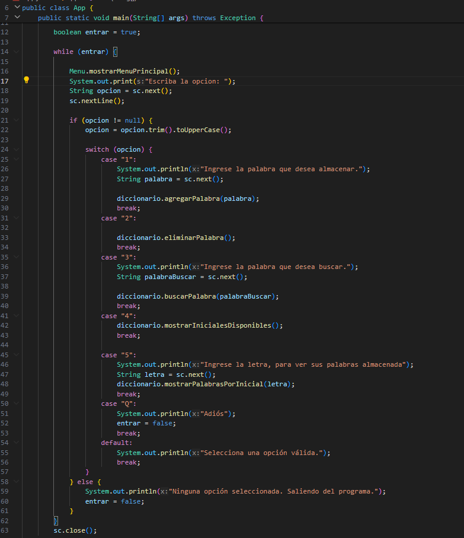

## CLASES EJECUTABLE

**App**

En la clase App, se encuentra la clase ejecutable del proyecto (Main), proporciona un bucle while para
garantizar la continuidad del programa, hasta que el usuario desee.
Desde esta clase se vinculan todos los métodos del proyecto y se sigue una lógica de menú

&nbsp;&nbsp;&nbsp;&nbsp;&nbsp;&nbsp;&nbsp;&nbsp;&nbsp;&nbsp;&nbsp;&nbsp;&nbsp;&nbsp;&nbsp;&nbsp;&nbsp;&nbsp;&nbsp;&nbsp;&nbsp;&nbsp;&nbsp;&nbsp;&nbsp;&nbsp;&nbsp;&nbsp;

---
- Regresar _**Manual del programa**_ [<<**aquí**>>](MANUAL_PROGRAMA.md) 