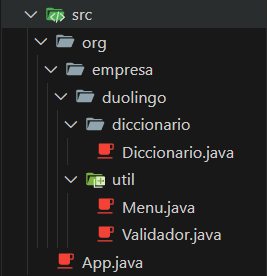

# Documentación del programa

_**DiccionarioDuolingo**, es un proyecto diseñado para facilitar la gestión de un diccionario de palabras en un entorno de aplicación de consola. La necesidad de este proyecto surge de la importancia de tener una herramienta eficiente para almacenar, buscar, agregar y eliminar palabras en un diccionario, especialmente en contextos educativos._

## Interfaz de Usuario
El diccionario usa una interfaz de usuario basada en consola. Este tipo de interfaz es ideal para ejecutar simulaciones y visualizar resultados de forma sencilla y efectiva sin la necesidad de desarrollar una interfaz gráfica compleja.

---
## ESTRUCTURA DEL CÓDIGO
El código fuente del proyecto está organizado de la siguiente manera:

&nbsp;&nbsp;&nbsp;&nbsp;&nbsp;&nbsp;&nbsp;&nbsp;&nbsp;&nbsp;&nbsp;&nbsp;&nbsp;&nbsp;&nbsp;&nbsp;&nbsp;&nbsp;&nbsp;&nbsp;&nbsp;&nbsp;&nbsp;&nbsp;&nbsp;&nbsp;&nbsp;&nbsp;&nbsp;&nbsp;&nbsp;&nbsp;&nbsp;&nbsp;&nbsp;&nbsp;&nbsp;&nbsp;&nbsp;&nbsp;&nbsp;&nbsp;&nbsp;&nbsp;&nbsp;&nbsp;&nbsp;&nbsp;&nbsp;&nbsp;&nbsp;&nbsp;&nbsp;&nbsp;&nbsp;&nbsp;&nbsp;&nbsp;&nbsp;&nbsp;&nbsp;&nbsp;&nbsp;&nbsp;&nbsp;&nbsp;&nbsp;&nbsp;&nbsp;&nbsp;&nbsp;&nbsp;&nbsp;&nbsp;&nbsp;&nbsp;&nbsp;&nbsp;&nbsp;&nbsp;&nbsp;&nbsp;&nbsp;&nbsp;&nbsp;&nbsp;&nbsp;&nbsp;&nbsp;&nbsp;&nbsp;

---
###CLASES EJECUTABLE
- Encuentra la clase _**Ejecutable**_ [<<**aquí**>>](CLASE_EJECUTABLE.md) 

###CLASES DICCIONARIO
- Encuentra la clase _**Diccionario**_ [<<**aquí**>>](CLASE_DICCIONARIO.md) 

---
###CLASES UTILARIAS
- Encuentra la clase _**Menu**_ [<<**aquí**>>](CLASE_MENU.md) 

- Encuentra la clase _**Validador**_ [<<**aquí**>>](CLASE_VALIDADOR.md) 